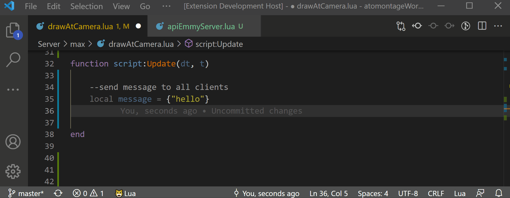

# Atomontage API Autocomplete

Atomontage API autocomplete for VS Code.

## Features

Autocompletions for classes, properties, functions, parameters. 
It also comes with the [Lua Language Extension](https://marketplace.visualstudio.com/items?itemName=sumneko.lua) to provide [IntelliSense](https://code.visualstudio.com/docs/editor/intellisense) for Lua.

Additionally through [Lua Language Server](https://marketplace.visualstudio.com/items?itemName=sumneko.lua):

- [x] Goto Definition
- [x] Find All References
- [x] Hover
- [x] Diagnostics
- [x] Rename
- [x] Auto Completion
- [x] IntelliSense
- [x] Signature Help
- [x] Document Symbols
- [x] Workspace Symbols
- [x] Syntax Check
- [x] Highlight
- [x] Code Action
- [x] EmmyLua Annotation
- [x] Multi Workspace
- [x] Semantic Tokens
- [ ] Type Format

## Requirements

* [Lua Language Server](https://marketplace.visualstudio.com/items?itemName=sumneko.lua)

## Extension Settings

Include if your extension adds any VS Code settings through the `contributes.configuration` extension point.

For example:

This extension contributes the following settings:

* `myExtension.enable`: enable/disable this extension
* `myExtension.thing`: set to `blah` to do something

## Known Issues

Calling out known issues can help limit users opening duplicate issues against your extension.

## Release Notes

Users appreciate release notes as you update your extension.

### 1.0.0

Initial release of vscode-atomontage-lua

